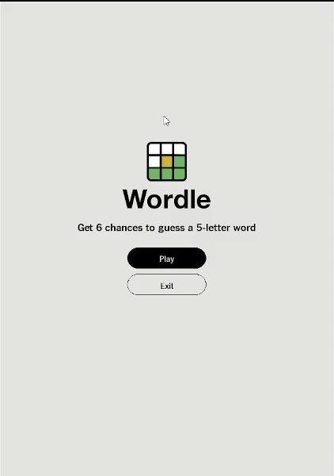

# 🎯 Wordle Clone

Welcome to **Wordle Clone**, a Python-based recreation of the popular word-guessing game! Test your vocabulary, logic, and deduction skills as you try to guess the secret 5-letter word in just 6 attempts. Can you master the challenge?

---

## 🚀 Features

- **Classic Wordle Gameplay**: Guess the 5-letter word in 6 tries or less.
- **Dynamic Keyboard**: Watch the on-screen keyboard update with green, yellow, and gray hints as you play.
- **Animations**: Enjoy smooth animations for letter input, guesses, and win celebrations.
- **Start and End Screens**: A polished user interface with a start screen, end screen, and restart functionality.
- **Error Feedback**: Get visual feedback for incomplete guesses.
- **Wave-Like Win Animation**: Celebrate your victory with a jump rope-style animation for the winning row.

---

## 🎮 How to Play

1. **Start the Game**: Click "Play" on the start screen to begin.
2. **Make a Guess**: Use your keyboard or the on-screen keyboard to input a 5-letter word.
3. **Submit Your Guess**: Press "Enter" to submit your guess.
   - **Green**: Correct letter in the correct position.
   - **Yellow**: Correct letter in the wrong position.
   - **Gray**: Letter not in the word.
4. **Win or Lose**: Guess the word in 6 tries to win, or see the correct word if you lose.
5. **Restart**: Click "Play Again" on the end screen to start a new game.

---

## 🛠️ Installation

1. **Clone the Repository**:
    ```bash
    git clone https://github.com/amina01hu/wordle-clone.git
    cd wordle-clone
    ```

2. **Install Dependencies**:
    Ensure you have Python 3.x and `pygame` installed:
    ```bash
    pip install pygame
    ```

3. **Run the Game**:
    ```bash
    python wordle-clone.py
    ```

---

## 📂 Project Structure

```
wordle-clone/
├── assets/                # Images and fonts for the game
├── wordle-clone.py        # Main game logic
└── README.md              # Project documentation
```

---

## ✨ Highlights

- **Custom Animations**:
  - Letter pop animation when typing.
  - Smooth box flip animation for guesses.
  - Wave-like jump animation for the winning row.
- **Dynamic Keyboard**:
  - Updates in real-time with color-coded hints.
- **Polished UI**:
  - Start screen with instructions.
  - End screen with results and restart options.

---

## 🖼️ Gameplay


---

## 🧩 Future Improvements

- Add support for custom word lists.
- Implement a stats tracker for win/loss records.
- Add a timer for speed-based challenges.
- Enhance animations for a more polished experience.

---

## 🤝 Contributing

Contributions are welcome! Feel free to fork the repository and submit a pull request with your improvements.

---

## 📜 License

This project is licensed under the MIT License. See the `LICENSE` file for details.

---

## 🌟 Acknowledgments

- Inspired by the original **Wordle** game by Josh Wardle.
- Built with ❤️ using **Python** and **Pygame**.

---

🎉 **Enjoy the game and happy guessing!** 🎉